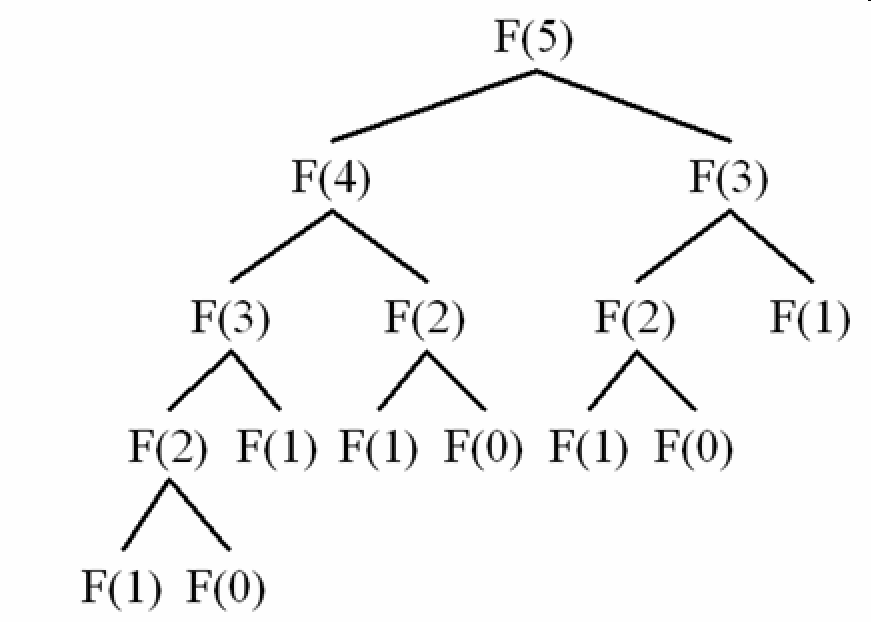

# Fibonacci

Probably some general concepts of `computer sciences` can be explained in the simplest form using this example.
Generating `n` terms of [Fibonacci serries](https://en.wikipedia.org/wiki/Fibonacci_number) seems a trivial task. 
However, it can be used to show how the poor implementation of any algorithm even for such a trivial problem could 
end up with scalability issues (in time and space or both).

## 1. Recursive Call - Brute Force Approach
The following implementation would be probably the first algorithm in your mind. 
Nothing is wrong with it! However, the exponential nature of the recursive calls will show up as a serious issue 
as the number of terms (`n`) of Fibonacci is getting higher! 

```
def fib_0(n):
    if n < 2:
        return n
    f = fib_0(n - 1) + fib_0(n - 2)
    return f
```



